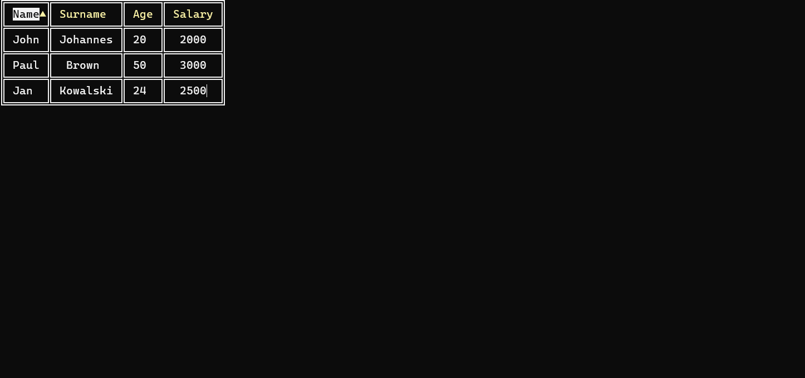
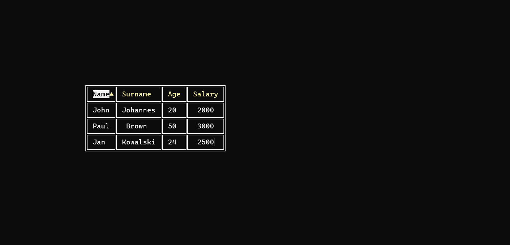
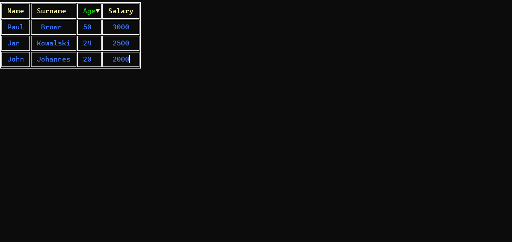

# 📋 Tables — Simple Tables in C#

Simple C# console application for creating fully customizable tables in the console.


## 📌 Functionality

- Creating tables
- Fully customizable table appearance:
  - Table orientation
  - Border style
  - Header style
  - Field style
- Sorting
- Pagination


## ⚙️ Usage

**⚠️ Important:** Every row must have the same number of columns.

### 📦 Initialization

```csharp
// With headers
Table newTable = new(true, "Name", "Age", "Country");

// Or without headers
Table newTable = new(true);
```
#### 📝 Add Headers

```csharp
newTable.AddHeaders("Name", "Age", "Country");
```

#### ➕ Add Rows

```csharp
newTable.AddRows("Alice", "30", "USA");
```


### 🎨 Table Style Customization
Use the static class TableStyle to adjust appearance:
```csharp
TableStyle.ForegroundFontColor = ConsoleColor.Green;
```
 Available customization options:
 - TableOrientation TableOrientation
 - Styles BorderStyle
 - ConsoleColor BorderColor
 - ConsoleColor HeaderFontColor
 - ConsoleColor HeaderBackgroundColor
 - ConsoleColor FontColor
 - ConsoleColor BackgroundColor
 - ConsoleColor SelectedFieldHeaderFontColor
 - ConsoleColor SelectedFieldHeaderBackgroundColor
 - int MaxSizeToDisplay
 Reset to default styles:
 ```csharp
 TableStyle.ResetTableStyle();
```

### 🔄 Sorting & Pagination
 - Use arrow keys for sorting and pagination.
 - Sorting is enabled only if true is set in the constructor.


### 📖 Example Usage
```csharp
Table employees = new(true, "Name", "Surname", "Age", "Salary");

employees.AddData("John", "Johannes", "20", "2000");
employees.AddData("Paul", "Brown", "50", "3000");
employees.AddData("Jan", "Kowalski", "24", "2500");

TableStyle.SelectedFieldHeaderFontColor = ConsoleColor.Green;
TableStyle.SelectedFieldHeaderBackgroundColor = ConsoleColor.Black;
TableStyle.FontColor = ConsoleColor.Blue;

// Initialize table with default position
employees.InitTable();

// Or with custom position
employees.InitTable(20, 10);
```
## 📸 Screenshots





